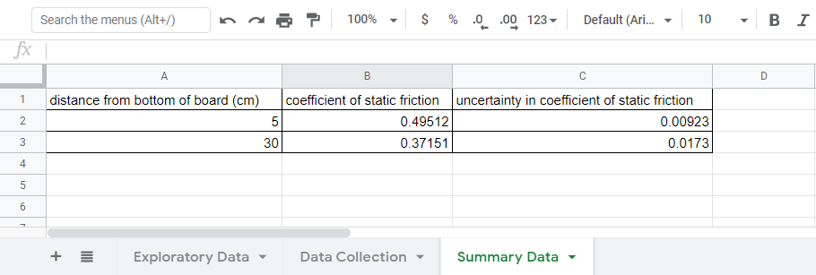
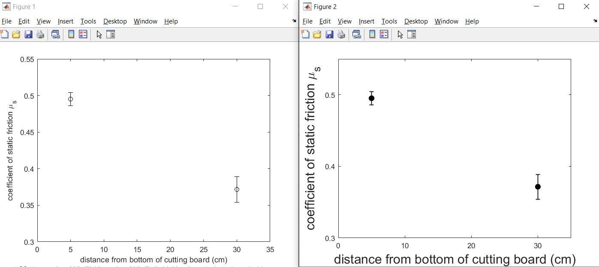
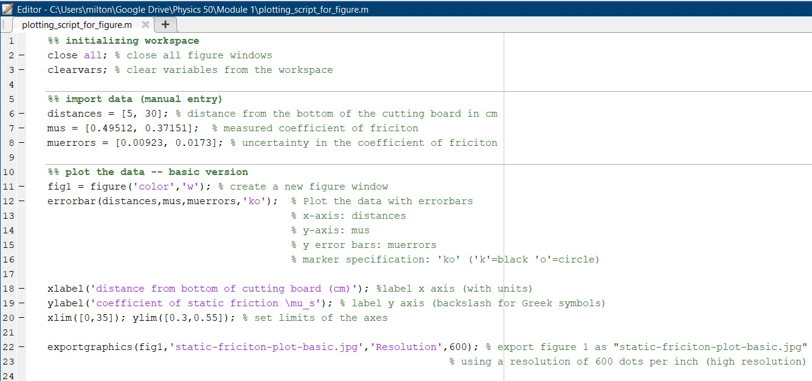
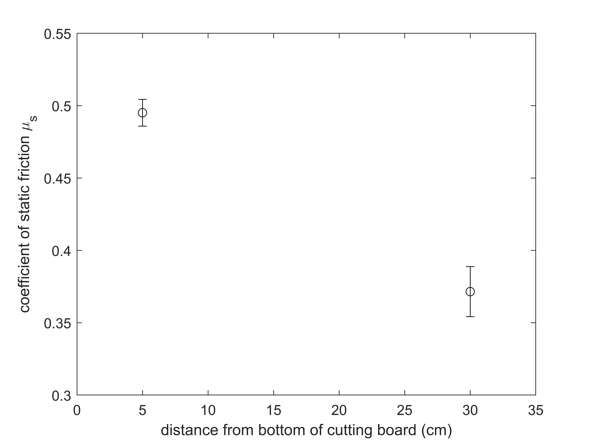
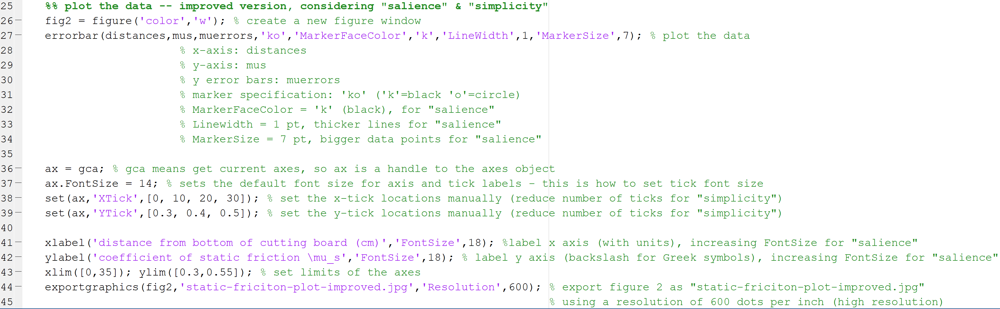
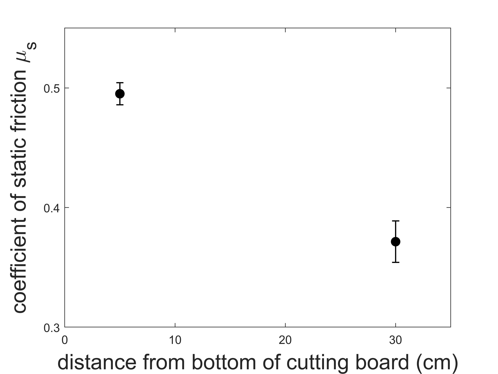
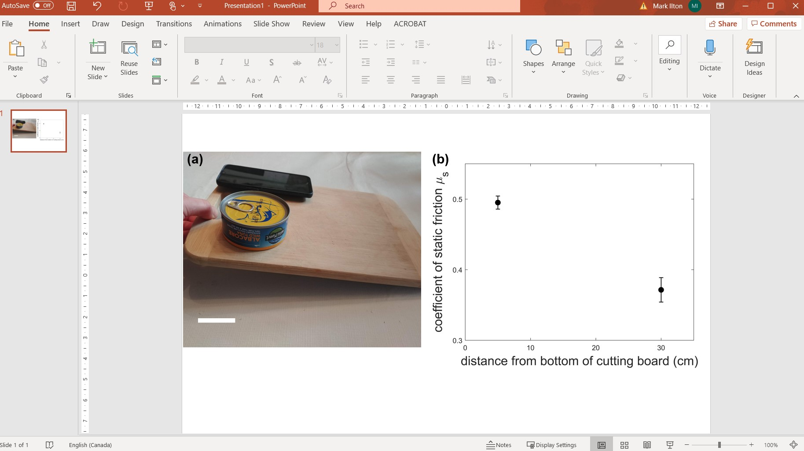

# Guide to plotting and creating a figure for Module 1

In this page, we are going to go through the steps of creating a plot in MATLAB, and then assembling that plot along with a photo of the experiment into a figure. We will use some data from an experiment that was studying the effect of location on the inclined plane (eg. cutting board) on the coefficient of static friction. For the purposes of this MATLAB guide, we will use example data that only features two data points, even though you will need to include 5 data points in your plot. Although this is different than the experiment you performed, the following steps are very similar to what you will need to do for your figure.

[Creating a plot in MATLAB](#plotting-with-matlab)

[Assembling the figure in Powerpoint](#assembling-the-figure-in-powerpoint)

## Plotting with MATLAB

Suppose we had the summary data organized in our Google Sheet:


We want to make a plot of $$\mu_s$$ vs distance from the bottom of the cutting board (with $$\mu_s$$ on the y-axis). We want to have error bars on the values of $$\mu_s$$ that represent the uncertainty in $$\mu_s$$. 

First, we will look at creating a "basic" plot with error bars. Then we will make some aesthetic tweaks to make the plot easier to read.

If you're new to MATLAB, you will want to watch this 5-minute video about [Working in the MATLAB Development Environment](https://www.mathworks.com/support/search.html/videos/working-in-the-development-environment-69021.html?fq=asset_type._name:video%20category:matlab/getting-started-with-matlab&page=1{:target="_blank"}).

And if you've never used a MATLAB "script" before, this 3-minute video gives an overview of [How to Create a MATLAB Script](https://www.mathworks.com/support/search.html/videos/managing-code-in-matlab-scripts-97216.html?fq=asset_type_name:video%20category:matlab/scripts&page=1).


----------
#### Plotting the example data

Now that you have an idea of how to run a MATLAB script, download this [MATLAB script for our example data plotted with error bars](plotting_script_for_figure.m){:target="_blank"}. Make sure you save the file into a meaningful directory (e.g. Ph50/Module1). If you open the script and run it in MATLAB, two figures should pop up (one might be behind the other) that are two versions of the same plot:

[*Click here to open image in a new tab*
](images/figure-windows.jpg){:target="_blank"}
*Note: the font sizes in your plots may be different than the ones shown here.*

Before we dig into the details of the MATLAB code, can you spot the differences between the two plots? 

The right hand figure requires more lines of code to produce, but most people find it easier to read and interpret. The right hand figure was generated with the principles of "salience" and "simplicity" in mind:

**"Salience"** means that an object is visually distinct from other objects around it (it stands out). When making a figure, we should aim to make the most relevant/important objects the ones with the most salience. In the case of the plot above, the right hand plot has the data points with filled-in circles and thicker lines, which makes those data points stand out. Because the relative location of the two data points and the size of the error bars is the relevant information needed to make a conclusion, we want to make them stand out (give them salience). The font size of the axis labels was also increased on the right hand plot which make the labels easier to read. Remember that we are going to create a two-panel figure for the Module 1 deliverable, so we need to make sure the fonts are still readable when we scale the plot down in size.

**"Simplicity"** means eliminating irrelevant and visually distracting information. In the case of the plots above, the right hand plot has fewer tick labels than the left plot. Fewer tick labels makes the plot look cleaner and less cluttered. Notice the x-axis of the left hand plot has tick marks at (0,5,10,15,20,25,30) cm but the right hand plot only has them at (0,10,20,30) cm. We don't lose our ability to see the value of the data points with fewer tick marks. 

Salience and simplicity are further [explained here with another example in MATLAB (optional)](https://bacteriophysics.web.illinois.edu/wp/wp-content/uploads/2019/02/figure-guide-ls-2016.pdf#page=4){:target="_blank"}.

For our plotting guide here, let's follow this plan:

1. understand the "Basic" version of the plotting with error bars script (that generated the left hand plot)

2. understand the "Improved" version of the plotting script (that generated the right hand plot)

### "Basic" Plotting in MATLAB with error bars
Let's dissect the plotting script you already downloaded [plotting_script_for_figure.m](plotting_script_for_figure.m){:target="_blank"}. The relevant lines of code are on lines 1-24.

[*Click here to open image in new tab*
](images/basic-plotting-script.jpg){:target="_blank"}

Reminder: the "%" symbols are comments in MATLAB.

#### Initializing the MATLAB Workspace [lines 1-3]
If you're running a script multiple times, it's generally a good idea to reset things first. This includes automatically closing figures and clearing any variables from the workspace that might be previously defined. 

#### Import Data (manual entry) [lines 5-8]
Next we need to import the data from our Google Sheet. Since we only have a couple of data points, it's fastest just to copy-paste them into our script manually. Another option if we had more data would be to download the Google Sheet as an Excel file or csv file, and then use the "Import Data" button in MATLAB. But let's keep things simple here and copy-paste the data manually.

#### Plot the Data -- "basic" version [lines 10-24]
Now that we have the data imported into MATLAB, we can plot it. We will use the "errorbar" function in MATLAB (don't forget that you can "Search Documentation" near the top-right of the MATLAB Development Environment for help on any function!):

"errorbar(X,Y,E) plots Y versus X with symmetric error bars 2*E(i) long. X, Y, E must be the same size. Each error bar is a distance of E(i) above and below the point defined by (X(i),Y(i))."

The plotting_script_for_figure.m uses errorbar on line 12:
``` MATLAB
errorbar(distances,mus,muerrors,'ko');  % Plot the data with errorbars
```
where the 'ko' plots the data points as a black circle (k=black, o=circle). 

Other important pieces in the code are setting the axes labels (lines 18-19), setting the range of the plot to zoom in on the data (line 20), and saving the plot as a high-resolution jpeg image (line 22). This should save the file "static-friction-plot-basic.jpg":



### Improved plot (easier to read)

The code for the improved plot with error bars is on lines 25-43 of [plotting_script_for_figure.m](plotting_script_for_figure.m){:target="_blank"}.

[*Click here to open image in new tab*
](images/improved-plotting-script.png){:target="_blank"}

To make the important parts stand out and the plot more readable, we add the following:

+ filling-in the data points by setting the 'MarkerFaceColor' to black, increasing the 'LineWidth' to 1 pt, and increasing the 'MarkerSize' to 7 pt (line 27)
``` MATLAB 
errorbar(distances,mus,muerrors,'ko','MarkerFaceColor','k','LineWidth',1,'MarkerSize',7); % plot the data
```

+ increasing font size to 14 pt for tick labels, and reducing the number of tick marks (lines 36-39)
``` MATLAB
ax = gca; % gca means get current axes, so ax is a handle to the axes object
ax.FontSize = 14; % sets the default font size for axis and tick labels - this is how to set tick font size
set(ax,'XTick',[0, 10, 20, 30]); % set the x-tick locations manually (reduce number of ticks for "simplicity")
set(ax,'YTick',[0.3, 0.4, 0.5]); % set the y-tick locations manually (reduce number of ticks for "simplicity")
```

+ creating axis labels, and setting their font size to 18 pt (line 41-42)
``` MATLAB
xlabel('distance from bottom of cutting board (cm)','FontSize',18); %label x axis (with units), increasing FontSize for "salience"
ylabel('coefficient of static friction \mu_s','FontSize',18); % label y axis (backslash for Greek symbols), increasing FontSize for "salience"
```

The script saves the result as a jpeg image "static-friction-plot-improved.jpg" (line 44):




**Important: Now that you understand some ways to customize your plot in MATLAB, you can delete the code for the "Basic" version (lines 10-24). You will need to alter the remaining code for plotting your data. You will need to import your own data, and you might also need to tweak some of the improvements. If you can't see your data points, then check that your data points fall within the "xlim" and "ylim" you are using.**


## Assembling the figure in Powerpoint
To create your two-panel figure for the Module 1 deliverable, we recommend using Powerpoint to assemble the parts. If you don't have Powerpoint installed, you can [get it free from HMC CIS here](https://www.hmc.edu/cis/services/office-365-education-for-students/).


Open a new Powerpoint presentation and insert both the images you have made (the plot you've created and a photo of your setup). 

For a scale bar, you will need to measure the length of a reference object (e.g. in real life, the tuna can is 8.5 cm in diameter). Then you can Insert->Shapes->Line in Powerpoint and make a scale bar of an appropriate size. 

Insert text boxes to label the panels (a) and (b). 




When you're satisfied with how the figure looks, select all of the objects on the slide, right click and "Save As Picture". You now have a saved figure file (save as either .png or .jpg for Gradescope submission please).
