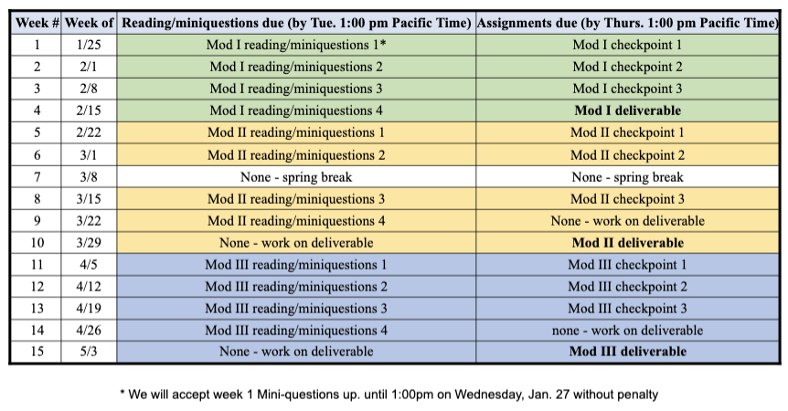

  
  

Instructors:  
J. Arlett (jarlett@hmc.edu) 
E. Connolly (connolly@hmc.edu) 
T. Donnelly (Tom_Donnelly@hmc.edu) 
S. Gerbode (gerbode@hmc.edu)

Graders: 
Kathleen Durkin  
Madison Hobbs 
Amy Qian

# Physics 50 Syllabus

+ [Reading and Miniquestions](#reading-and-miniquestions)
+ [Weekly Checkpoints](#weekly-checkpoints)
+ [Module Deliverables](#module-deliverables)
+ [Grading](#grading)
+ [Late Policy](#late-policy)
+ [Online Resources](#online-resources)
+ [Lab Books and Data Sheets](#lab-books-and-data-sheets)
+ [Collaboration](#collaboration)
+ [Writing Center](#the-writing-center)
+ [Accomodations, Wellness, Belonging, Title IX](#Accomodations)

# Preamble
Our goal in this course is for you to focus on the experimental process rather than racing to complete a list of tasks in a tight time frame. In each module you should first follow directions to gain familiarity with a broad set of equipment, techniques, and phenomena.  In each module we will then guide you to take opportunities to investigate some aspect of the situation more deeply. Your ultimate task is to communicate the results of your experimental research.

In order to be successful in this course you:
+ are actively engaged and reach out for help on Piazza and/or come to office hours when you get stuck 
+ complete mini-questions, checkpoints, and deliverables on time
+ document your work as you go along
+ design an experiment and carry it out, refine your methods along the way, go back and address major problems--do something, think about it, improve upon it
+ reflect on your results, identify main limitations and correct glaring omissions, identify any questions that your results raise
+ think about the next questions that would arise in the next iteration of the experiment 
+ present your final results without major factual errors that undermine your credibility  (statements of fact versus we think this is happening because of xyz)
+ tell the story about why you did what you did and what conclusions you can draw

If we (your instructors) could do all of these all of the time we would be better physicists and probably better people in general. We are looking for you to demonstrate competence in these areas; we do not expect perfection.

By the end of this course you will be able to collect, analyze, and interpret real measured data in an ethical manner and draw meaningful conclusions from personal observations of the physical world. Knowing what questions to ask and what pitfalls to be on the lookout for is not always easy and is something of an art. To help you to be successful we will provide a large amount of guidance in the earlier labs, prompting you often to stop and think about various aspects of your experiment. As the semester progresses we will gradually taper off the guidance, and we will begin to focus more on how to best communicate your results. Scientific communication is an essential part of doing experimental research.

# Course Structure
In this course you will work on three modules that each will last four-five weeks. In each week of each module, you will start by reading the online manual (linked on Sakai) and completing the associated embedded miniquestions (due by Tuesday 1 pm). Each week you will submit a checkpoint via Gradescope, due by Thursday, 1 pm. Finally, at the end of each module you will submit a module deliverable via Gradescope.

# Reading and miniquestions
Each week you will start by going to the module website (linked from Sakai). There you will find detailed procedures and lab instructions, with miniquestions embedded throughout the text. These miniquestions are intended to help you quickly confirm your understanding of what you are reading and should be completed as you are reading. After submission of a miniquestion, if your answer is incorrect you will be prompted to resubmit your answer. In order to receive credit for your resubmission, you must explain why your new answer is correct. When resubmitting remember that your goal is not to describe what you did wrong but rather to explain and clarify the correct answer.

# Weekly checkpoints:
At the end of each week you will complete a weekly checkpoint and submit it via Gradescope. Take any deductions on checkpoints seriously even if they are small. By the end of the module we expect that any issues will be addressed in your final deliverable. Come to office hours to discuss your checkpoint feedback, we are here to help!

# Module deliverables
The end-of-module deliverables focus on the critical skill of scientific communication. In physics, the process of writing often begins with creating a sequence of figures with captions. This visual outlining procedure lays the groundwork for all the details that eventually fill in the space in between the figures. The module deliverables are structured to guide you through this physics writing process. Detailed instructions for each deliverable will be provided in each module website (linked from Sakai), but briefly:

+ For Module I, you will create a figure with a caption that summarizes the result of your experiment. 
+ For Modules II and III, you will create a sequence of 3 figures that, along with captions, effectively tell the story of your Module II experiment: what you did, and what your results mean. 

# Grading
The course grade will be calculated based upon your performance on each of the three modules, which are weighted equally. For each module, your grade will be based upon your timely completion of the reading miniquestions (15%) and checkpoints (25%), and upon the quality of your module deliverable (60%). All three modules must be satisfactorily completed to pass this course. 

# Late Policy
Late work will be accepted within the windows listed below with the following deductions. These deductions are based on the available points for the item, not your score:

## Miniquestions
+ Up to 24 hours past the deadline: 10%
+ Up to 48 hours past the deadline: 20%

## Checkpoints and Deliverables
+ Up to 5 hours past the deadline: 5%
+ Up to 24 hours past the deadline: 10%
+ Up to 48 hours past the deadline: 15%
+ Up to 72 hours past the deadline: 20%

In recognition that this is a very unusual semester you may have two extensions of up to 24 hours without penalty over the course of the semester, provided you let us know in advance by e-mailing jarlett@hmc.edu that you would like the assignment to count for one of these extensions. (The extensions may be used for mini-questions, checkpoints or deliverables.) If you are experiencing extenuating circumstances please don't hesitate to reach out. 

# Online Resources
The course website is available on Sakai, where you will find links to each Module of the course in the side menu of the Physics 50 page. Also linked from that page are Gradescope, Piazza, and Zoom. You will submit the Module checkpoints and deliverables through Gradescope. To create another way for students to communicate asynchronously with each other we have created [this Piazza site](piazza.com/hmc/spring2021/ph50/home){:target="_blank"}. In Piazza you can ask questions to the class; we encourage you to use this forum to ask your classmates course-related questions and to answer each others questions. There are no grades associated with participation on Piazza, it is for your own benefit as a means to collaborate asynchronously with each other. Office hours are offered by all the instructors -- students should feel welcome to join any professor’s office hours. The office hour starting times are listed and hosted out of the “Office Hours” link on the side menu of Sakai. Clicking on an office hour will expand the information to include a zoom link as well as the start and end times for each office hour. Please note that you must be logged into your g.hmc.edu account through a Google Chrome browser to access this information.

We will also be using Google apps including Docs, Sheets, and Colaboratory. There will be several templates assigned at various times throughout the course via Google Classroom. Google Classroom enables us to create copies of documents for every student. You will need to login to Google Classroom when prompted from the Module instructions, but you do not need to actively monitor Google Classroom for new assignments. Sakai is our primary point of contact with you, not Google Classroom.

# Lab Books and Data Sheets
## Lab Books
In this course we will not be using traditional lab books. Instead you will be assigned a Google Doc at the beginning of each module to keep your lab record. What we will stress in this course is not a particular structure or format for your lab book, but rather the usefulness of the record. 

What information will I need to replicate this experiment in 6 months or 6 years? Would a sketch or photo of the setup be helpful? How exactly did I take that particular data point? What did or did not work in my experimental procedure and what did I learn from it? What are my units? What does this variable mean? etc.

Your lab book will not receive a grade of its own, but the quality of your lab book will impact other graded portions of the lab. The hallmark of a good lab book is how useful it is to you and others at a later point in time. You will need the information from your lab book to complete your checkpoints and end of module deliverables. Detailed notes will be useful!

Some tips: 

+ Don’t rewrite history. 
    + If you realize you made a procedural mistake, resist the temptation to omit what was incorrect. Your lab notebook needs to be a complete record of what actually happened; that means the bad as well as the good.
    + Suggestions: use the comment feature, make a note in a different color (note the date if different), or highlight your mistake and refer yourself to further down the document where you’ve written up the correction. Find the method that works for you, but be sure your record is complete.
+ Include handwritten work.
    + There is rarely a lab that does not require a sketch or calculation. Do not use “scratch paper” without including it in your lab record. 
    + Google Docs has an app that allows you to insert a photo directly into your document from your phone. You can also use a camera to take a photo of your notes and upload them to your computer.
+ Include photos of your apparatus.
    + A picture truly is worth a thousand words when you are trying to remember how to set up your apparatus, or how to take a particular measurement.
    + It can be particularly powerful to upload a photo and then annotate it with a few well-placed arrows, words, etc.
+ Link to your various electronic files (Google Sheets, Colaboratory, etc) in the body of your document in the context of describing how you took that particular data. 
    + You can simply copy the URL of the item you wish to link to and paste it into your document.

## Data Sheets
We would like you to get in the habit of using formulae in Google Sheets to make your intermediate calculations. This helps avoid mistakes and it’s easier to fix any mistakes later. Although we aren’t grading your data sheet or lab notebook, we will look at them occasionally when grading your checkpoints and/or ask to see them in office hours. If we see formulae in your data sheet, we can more effectively help you debug any problems.

# Collaboration
We expect every student to perform the data analysis, miniquestions, checkpoints, and deliverables for themselves. If you would like to discuss with a classmate while doing measurements/analysis in parallel, we encourage that type of collaboration! It will likely not save you any time, but often working through material together gives a better learning experience. Just remember that each of you needs to do your own measurements and analysis.

# The Writing Center
The Writing Center provides a welcoming virtual space for writers to get feedback on their composition projects, whether written, spoken or visual pieces. Writing Center Consultants are prepared to assist students in any discipline with any stage of the writing process, from developing an idea to polishing a final draft. Even the most accomplished writers benefit from seeking feedback at the Writing Center. You may schedule an online appointment through their website, https://www.hmc.edu/learning-programs/writing-center/

# Accommodations
HMC is committed to providing an inclusive learning environment and support for all students. Given our current online learning environment, we recognize that the challenges facing students are different and student accommodation needs may change. Students with a disability (including mental health, chronic or temporary medical conditions) who may need some accommodation in order to fully participate in this class are encouraged to contact Educational Accessibility Services at ability@g.hmc.edu to request accommodations. Students from the other Claremont Colleges should contact their home college's disability resources officer.

# Wellness 
College can be stressful, and it’s important to support the physical and mental well-being of ourselves and others even as we work to learn challenging new material in courses like this one. That means getting some food, sleep, exercise and relaxation even during crunch time! If you find that you are in need of help or overwhelmed by this class, don’t hesitate to reach out to any of the course instructors or the Academic Deans at academicdeans@g.hmc.edu. We will work with you to develop a plan for success in this course. 

# Belonging
Everyone who is registered for this course belongs here and has valuable contributions to make to our class. Our diversity of backgrounds, experiences, and viewpoints will enrich the classroom, and our mutual respect will allow us all the grace to make mistakes and learn from them.

# Title IX Notification
Harvey Mudd College is committed to providing an environment free of all forms of discrimination and sexual harassment, including sexual assault, domestic violence, dating violence, and stalking. If you (or someone you know) has experienced or experiences any of these incidents, know that you are not alone. We are available to talk to you if you are in need although we are obligated to report any contraventions of Title IX to the HMC Title IX Coordinator, Jennifer Alanis (jalanis@hmc.edu). If you want to speak to someone confidentially, the following resources are available on and off campus: the EmPOWER Center (909-607-2689), the Monsour Counseling Center (909-621-8202), the Project Sister Family Services' 24-hr sexual assault hotline (909-626-4357, ask for HMC Advocates) and the McAlister Chaplains (909-621-8685). Additional information about your options is also available at https://www.hmc.edu/tix. 

