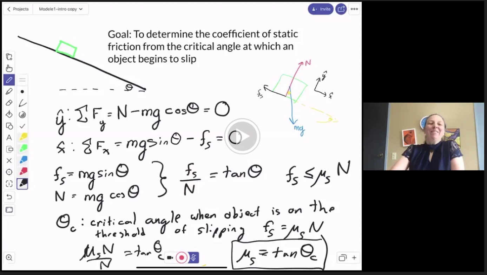
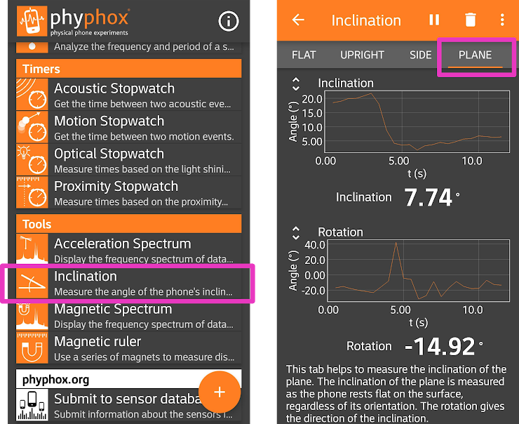
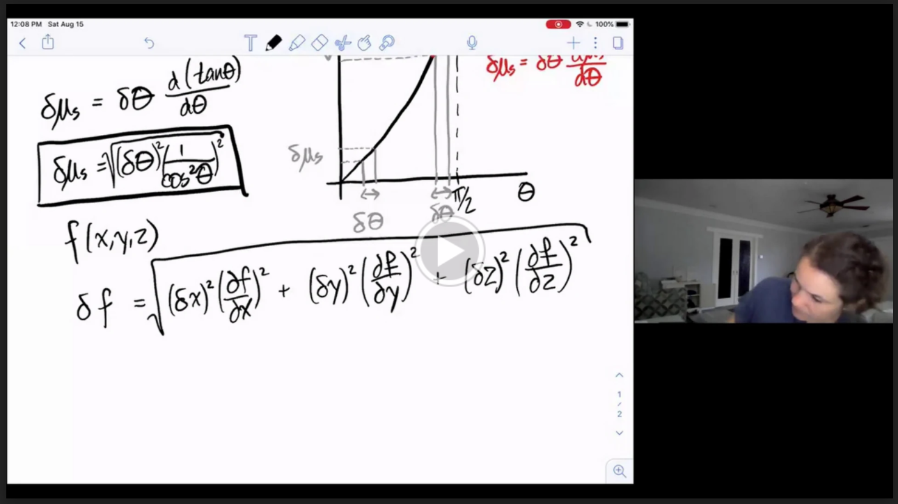

# Week 1: Exploratory Phase

--------------
1. [Preface](#preface)
2. [Background Reading](#background-reading)
3. [Formulating a Hypothesis](#formulating-a-hypothesis)
4. [Instrumentation](#instrumentation)
5. [Exploratory Measurements](#exploratory-measurements) (and continued in Week 2)
6. Designing the Experiment (Week 2)

--------------
Please note that in order for the Google classroom link below to work you must first go to Google Classroom through a Chrome browser logged into your g.hmc.edu account and join the class with classroom code: ak7xp3q  - once you've done this once you will not have to log into Google classroom again and all links to documents we provide through Google classroom will work.

**The course will not appear in your Google Classroom account until you join the course with the class code.**

We begin our investigation of measuring $$\mu_s$$ by doing an initial exploration. Our goal is to come up with a hypothesis to test and a plan for how we will do so (an experimental design). In the Exploratory Phase it can be especially important to take detailed notes. Organizing a digital lab notebook and data spreadsheet can be tricky, so for Week 1 we are providing a [template for you to follow along with that we've assigned from Google Classroom](https://classroom.google.com/u/0/w/MjUxNTgyMzY1MDM5/t/all){:target="_blank"}. The class code to join the Google classroom site is: ak7xp3q. Please make sure to join Google classroom from your g.hmc.edu account. Students from other Claremont colleges taking the course should consult HMC's CIS support if you have any issues - they will issue you a g.hmc.edu account.

**Make sure you have this spreadsheet and your Module 1 Lab Notebook handy as you go through the content on this Week 1 page. Please note that we require you to use the provided spreadsheet/lab notebook. The shared spreadsheet will make it easier for us to troubleshoot if any issues come up.**

## Preface
If you have any questions working through this course remotely we encourage you to reach out to your classmates through the class Piazza site or come to office hours to talk to an instructor. [Sign up for the class Piazza site](https://piazza.com/hmc/spring2021/ph50)

Before diving into data collection and analysis we would like to set some expectations. This course centers around the collection, analysis, and communication of experimental data and results. We expect all of these to be conducted with care and integrity.

Collaboration:
We expect every student to perform the data analysis, miniquestions, checkpoints, and deliverables for themselves. If you would like to discuss with a classmate (either a roommate or via Zoom) while doing measurements/analysis in parallel, we encourage that type of collaboration! It will likely not save you any time, but often working through material together gives a better learning experience. Just remember that each of you needs to do your own measurements and analysis.

To make sure we all start on the same page please answer the following mini-questions (mini-questions will appear through this manual and are required. Please see the syllabus for more information regarding mini-questions).

--------------------

#### Miniquestion: Acceptable forms of collaboration
*[Click here to open in a new tab](https://docs.google.com/forms/d/e/1FAIpQLSc1cnV36goAOx-2CoKGTioDpyajLhYshON1zceV19wu0WG5wQ/viewform){:target="_blank"}*

<iframe src="https://docs.google.com/forms/d/e/1FAIpQLSc1cnV36goAOx-2CoKGTioDpyajLhYshON1zceV19wu0WG5wQ/viewform?embedded=true" width="640" height="300" frameborder="0" marginheight="0" marginwidth="0">Loading…
</iframe>

------------------------------

Data Collection:
Please make sure you read the tips for Electronic lab notebooks in the syllabus. We emphasize that your notebook is a record of the experiment. Deleting experimental data from a lab notebook is never acceptable. However, it is acceptable to remeasure/reanalyze data because of inaccurate or incorrect initial efforts. This includes recollecting data with an improved experimental procedure. An example of an acceptable procedure would be: 

You are trying to time how fast your little brother can run. Initially you do this in your hallway but you realize you are getting inaccurate results. You take him to a track and restart the experiment in a way that is less sensitive to the initial conditions. You make a note next to the data you collected with a procedure you believe to be less reliable and then focus on the newly collected data in your analysis, but you do not delete the original data from your lab notebook.

--------

#### Miniquestion: Handling data
*[Click here to open in a new tab](https://forms.gle/vuCCDuDNYRaWeC7e6){:target="_blank"}*

<iframe src="https://docs.google.com/forms/d/e/1FAIpQLSeAKMIHuPP0wX4WZKX78GnCsjuOFV63meAfYjctYu1r6kWlMg/viewform?embedded=true" width="640" height="300" frameborder="0" marginheight="0" marginwidth="0">Loading…
</iframe>

------------------------------

You may find yourself in a situation where it isn't as clear what is acceptable. When in doubt please ask. Both the class Piazza discussion board and office hours are great ways to reach out with questions!

## Background Reading

Often the first step is to do some background reading and theoretical analysis. We are measuring the coefficient of static friction: a dimensionless number that depends on the two surfaces in contact. This video from Prof. Arlett on how $$\mu_s$$ and $$\theta_c$$ are related will provide some background and a quick refresher:
{:target="_blank"} 

In your lab notebook, try the derivation yourself and document the result.

## Formulating a Hypothesis

We can now try to think of a hypothesis we can test with an experiment. As a quick check, according to the theory, which of factors will affect a measurement of $$\theta_c$$?

#### Miniquestion: Critical Angle Factors
[*Click here to open in a new tab*](https://forms.gle/oUrvxpsg5foNjnVH7){:target="_blank"}

<iframe src="https://docs.google.com/forms/d/e/1FAIpQLSfFH6ZBvZzAlN_LNJQqnmFCPN97KyLGW44mU-AsTd_XSAxcTw/viewform?embedded=true" width="640" height="300" frameborder="0" marginheight="0" marginwidth="0">Loading…
</iframe>

-----

Based on this answer, try to come up with some hypotheses you could try to test. The theory makes specific predictions, and you can use those predictions to form the basis of a hypothesis. To encourage interaction with your classmates We encourage you to post some of your ideas and check out others [on the "Hypotheses" note on Piazza](https://piazza.com/class/kijtj4yqer66na){:target="_blank"}. There are no grades associated with Piazza, this suggestion is just to introduce you to the platform and encourage with 

**For Module 1 we will all test the same hypothesis. The hypothesis we will test is:**

*"The coefficient of static friction between two surfaces as measured by the critical angle at which an object slips is independent of its mass."*

## Instrumentation

Now that we've decided what we hypothesis we are going to test, we need to figure out what equipment and experimental tools we are going to use. For this module, we are going to make use of whatever you have on hand. 

You will need a "block" and a "ramp" (e.g. a hard pencil case on a hardcover textbook) that satisfy the following requirements:

+ both items need to have flat, rigid surfaces
+ when you tilt the ramp, the block needs to slide without rolling or tipping
+ a way to add mass to the block without changing the surfaces in contact between the block and ramp

Share your ideas and check out what others are doing at [Piazza: Instrumentation for Module 1](https://piazza.com/class/kijtj4yqer66na){:target="_blank"}.

To measure the angle we will use your phone or a tablet as the tool. Please go to [phyphox.org](https://phyphox.org){:target="_blank"} (or to the app store on your device) and download the phyphox app. After downloading, find the "Inclination" tool and test that it works correctly with your phone.

Make note of your equipment in your lab notebook (record keeping is important) and record any other notes you think might be helpful if someone else was trying to replicate your setup. 

## Exploratory Measurements

The exploratory measurements can be a fun part of the experimental process. You get to play around with your setup and make some observations! You can really let your curiosity and creativity guide you in this part of the experimental process. 

For your exploratory measurements in Module 1, we would like you to do the following:

+ Perform a single measurement to check that you are getting a reasonable answer

+ Get an understanding of the repeatability of your measurement 

+ Perform a preliminary test of your hypothesis

+ Check other factors that might affect your measurement (this is where you get to play!)

The steps below guide you through these four items, and provide links to important concepts (so please follow along carefully). Make sure you are recording your exploratory observations as you go so that you have a record of them (reminder: we have set up [a spreadsheet for you on Google Classroom](https://classroom.google.com/c/MjUxNTgyMzY1MDM5/a/MjUxNTgyMzY1MDQ5/details){:target="_blank"}, use the "Exploratory Observations" tab to record your data in this section).

#### 1 Perform a Single Measurement

Usually one of the first exploratory steps is to use your equipment to take a single measurement. We want to make sure that our measurement (in this case, $$\theta_c$$) will lead to a reasonable value of the calculated quantity we are trying to obtain ($$\mu_s$$). We also want to get a sense of the resolution of our measurement device and how that will affect the uncertainty measured in the calculated quantity. 

+ Place the block on the ramp and slowly raise the ramp while keeping an eye on the plane inclination measurement on the phyphox app. Record in the spreadsheet the value of the angle you observe just before slipping (in other words, perform a single measurement of $$\theta_c$$).

+ The "Uncertainty Introduction" has information we are going to need in Ph50 about treating sources of experimental uncertainty. Please first read both the [overview on uncertainties](uncertainty-introduction#overview){:target="_blank"} and also about [resolution uncertainty](uncertainty-introduction#resolution-uncertainty){:target="_blank"} ($$\approx$$ 5 minutes).  

    Then record the resolution uncertainty for the critical angle $$\delta_\mathrm{res.} \theta_c$$ in your exploratory observations spreadsheet.

| $$\theta_c$$ (degrees) | $$\delta_\mathrm{res.} \theta_c $$ (degrees) |
|:-----------------------:|:---------------------------------------------:|
 | ...            |   ... |

+ Calculate $$\mu_s$$ from your single measurement of $$\theta_c$$ (using the relationship you derived in the [background reading](#background-reading)). 

*Friendly reminder: convert the angle from degrees to radians in your Google Sheet calculation. **You also need to convert your uncertainty in the angle from degrees to radians in the same manner**.*

+ Learn how to propagate uncertainties from this video of Prof. Gerbode explaining how to propagate uncertainty in $$\theta_c$$ to uncertainty in $$\mu_s$$ and answer the mini-question below

{:target="_blank"}

--------

#### Miniquestion: Uncertainty Propagation
*[Click here to open in a new tab](https://docs.google.com/forms/d/e/1FAIpQLSdGBpAsDmSC8Ndwu0ksH5ViBPUN4lclLMx04Tl8R2vVia4pQw/viewform?){:target="_blank"}*

<iframe src="https://docs.google.com/forms/d/e/1FAIpQLSdGBpAsDmSC8Ndwu0ksH5ViBPUN4lclLMx04Tl8R2vVia4pQw/viewform?embedded=true" width="640" height="303" frameborder="0" marginheight="0" marginwidth="0">Loading…
</iframe>

------------------------------

After watching the video from Prof. Gerbode, let's return to your measurement of $$\mu_s$$ from $$\theta_c$$:

+  Calculate the resolution uncertainty in measuring the coefficient of static friction $$\delta_\mathrm{res.} \mu_s$$ by propagating your uncertainty $$\delta_\mathrm{res.} \theta_c$$. Derive any formulas you use in your lab notebook.

| $$\mu_s$$  | $$\delta_\mathrm{res.} \mu_s $$ |
|:-----------------------:|:---------------------------------------------:|
 | ...            |   ... |

Comment on whether your measured value is reasonable (e.g. is $$\mu_s$$ within the limits of allowable values, i.e. between 0 and infinity?  With a quick google search, is it similar to $$\mu_s$$ for similar surfaces? Is your fractional resolution uncertainty reasonably small,  (fractional resolution uncertainty $$\equiv \frac{\delta_\mathrm{res.} \mu_s}{\mu_s}<<1$$)? In other words, confirm that the uncertainty in $$\mu_s$$ less than the value of $$\mu_s$$ itself?

*At this point, if your answer were to be unreasonable or you were unable to calculate the quantity you are interested in testing (in our case $$\mu_s$$), then it would be a good idea to carefully rethink your measurement. Doing this initial single measurement and check can save a lot of time, especially when the experimental setup gets more complicated as it will later in the course. If you're stuck, [post a question up on our Piazza site](https://piazza.com/class/kdyuyniyaz052s){:target="_blank"} and [come to Office Hours](https://sakai.claremont.edu/portal/site/CX_mtg_130832/page/8bb99f43-12a4-4f97-8e47-802814328a26){:target=_"blank"}*

Before you submit Checkpoint 1, let's first double-check your procedure. Using the exact same procedure as you did to calculate your $$\mu_s$$  and  $$\delta_\mathrm{res.} \mu_s $$ above, complete the following miniquestion with a different measurement of $$\theta_c$$:

#### Miniquestion: Calculating coefficient of static friction and resolution uncertainty
[*Click here to open in a new tab*](https://forms.gle/mvteqnKeZNQXDytZ9){:target="_blank"}

<iframe src="https://docs.google.com/forms/d/e/1FAIpQLSdKSGfERWII08uU0DZio3Wtcul85SiBFLkbG44IAQgMJg4hMg/viewform?embedded=true" width="640" height="300" frameborder="0" marginheight="0" marginwidth="0">Loading…
</iframe>

-------------

Before we wrap up week 1, we need your mailing address to send you an experimental kit for Module 3. Please make sure this is an address at which you will be able to receive a package at some point over the next six weeks. If there are any special circumstances (e.g. you are expecting to move in the coming weeks) please reach out to us directly.

---------------------------------

#### Miniquestion: Mailing Address
[*Click here to open in a new tab*](https://docs.google.com/forms/d/e/1FAIpQLSc-Z5SUG8NmNFJhllyxUmiR3bxDAAo4I5Bpv4-vO9Y64hfyew/viewform){:target="_blank"}

<iframe src="https://docs.google.com/forms/d/e/1FAIpQLSc-Z5SUG8NmNFJhllyxUmiR3bxDAAo4I5Bpv4-vO9Y64hfyew/viewform?embedded=true" width="640" height="300" frameborder="0" marginheight="0" marginwidth="0">Loading…
</iframe>

--------------
## Checkpoint 1

**Please note that the first time you access the class Gradescope site you need to do so through Sakai (using the Gradescope link from the items on the left). Once you have done so once all Gradescope links in the manual will work going forward.**

+ [Submit the results of your single measurement on Gradescope](https://www.gradescope.com/courses/216639/assignments/904955){:target="_blank"}. The Gradescope assignment includes a sample calculation to ensure you are calculating $$\mu_s$$ and propogating the uncertainty correctly.

+ And to double-check, make sure you have finished all of this week's mini-questions by [checking here](mini-questions#week-1){:target="_blank"}

## Sample Rubric for Grading of Checkpoint 1

The first checkpoint will be graded primarily on completion. We are providing a draft grading rubric. These deductions are intended primarily to ensure you are prepared for week 2 and to be successful in the module. On this and all checkpoints please take even small deductions seriously. For example, deductions such as the 0.2 point deduction at the end of this rubric are intended to point out issues that we do not want to penalize in a substantial way on an early checkpoint but that you will need to address in order to move forward successfully. Please recognize that while we plan to follow this rubric we may make adjustments if needed. These adjustmets may include zero point deductions. Please don't assume that becasue a deduction is zero points it isn't important. It may be for an important error that we chose not to take off points for at an early stage in the course but are more likely to deduct points for next time. Since the deductions are intended to provide feedback to help you be successful on future checkpoints, if you don't understand our suggestions, please stop by office hours to talk to us.

The checkpoint is graded out of 10 points.

**Anticipated week 1 checkpoint deductions:**
+ Incorrect result for the sample calculation of the $$\mu_s$$ [-1 point]
+ Sample Calculation: Incorrect result for the propogated resolution uncertainty [-1 point]
+ Reported critical angle departs substantially from expectations [-1 point]
+ $$\mu_s$$ calculated incorrectly [-1 point]
+ Propogated resolution uncertainty departs substantially from expectations [-1 point]
+ Possible issues with your choice of block and ramp. For example, do you have a plan on how to add mass to your "block"? [-0.2 points]
+ Deductions for failing to submit the checpoint on time as outlined in the syllabus

When you're all finished and ready to move on, you can start [Week 2 - Exploratory Phase (part 2)](week2).
