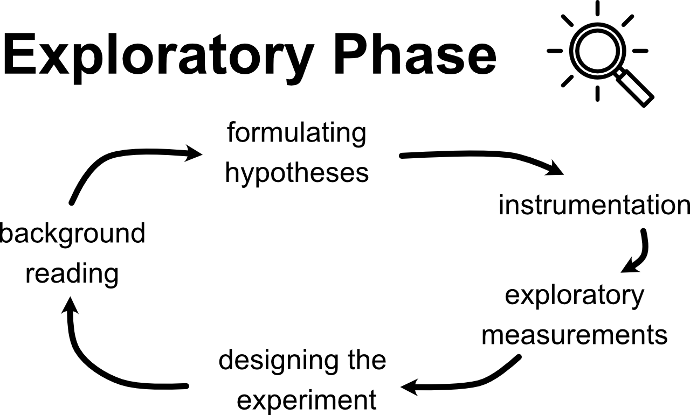

# Week 2: Exploratory Phase (continued)

--------------
1. Background Reading
2. Formulating a Hypothesis
3. Instrumentation 
4. [Exploratory Measurements](#exploratory-measurements) (continued from Week 1)
5. [Checkpoint 2](#checkpoint-2)

------------------

**Make sure you have your [Module 1 Data Sheet and Lab Notebook](https://classroom.google.com/c/MTI2NjQ0NDEyMTAx/a/MTI3ODQ4MDY2NDMx/details){:target="_blank"} handy as you go through the content on this Week 1 page.**

## Exploratory Measurements

#### 1 Perform a Single Measurement

From Week 1, you should have completed a single measurement of the critical angle and its resolution uncertainty $$\theta_c \pm \delta_\mathrm{res.}\theta_c$$. From that you propagated the uncertainty to calculate $$ \mu_s \pm \delta_\mathrm{res.} \mu_s$$, and concluded that your result was reasonable. If that isn't the case, please revisit [Week 1](week1) and [consult your classmates on Piazza](https://piazza.com/class/kijtj4yqer66na){:target="_blank"} or [come to Office Hours](https://sakai.claremont.edu/portal/site/CX_mtg_130832/page/8bb99f43-12a4-4f97-8e47-802814328a26){:target=_"blank"}. 

#### 2 Perform a preliminary test of the hypothesis

The goal of the preliminary test is to understand what challenges there might be to making a conclusion and have that inform your experiential design. The goal at this point is **not** to actually test the hypothesis or come to any conclusions yet!

Remember our hypothesis for Module 1 is:

*"The coefficient of static friction between two surfaces as measured by the critical angle at which an object slips is independent of its mass."*

Perform a single measurement of $$\theta_c$$ for a few different masses (choose the masses to cover as broad of a range as you have available). Report whatever units you are using for the mass. This could be in grams if you have a scale available, but other unconventional units are okay too (e.g. mass in terms of the number of tuna cans or whatever object you are using as the block).

mass (what units?) |$$\theta_c$$ (degrees)
|:-------:|:-------------------------:|	
 . |			
.	|		
 .	|		

		

In this step, we are trying to get a rough sense of how big of an effect our independent variable (mass) might cause experimentally. The size of the effect will inform what amount of experimental uncertainty will allow us to draw a strong conclusion. 

How does the difference in $$\theta_c$$ for different masses compare to the resolution uncertainty of your measurement?

#### 3 Test Repeatability

Now that we are confident we have a reasonable value of the quantity we are trying to measure, and have some sense of how large the effect we are trying to measure might be, we should test the variability in our experimental measurement.

Read [this discussion about random uncertainty](uncertainty-introduction#random-uncertainty) 

The goal of testing repeatability is to get a sense of the random error associated with the measurement. 

Take a few measurements of $$\theta_c$$ under identical conditions (say 4 or 5). Make sure you "reset" your experimental setup each time: start the ramp from a horizontal position ($$\theta = 0$$), place the block onto the ramp, and then slowly start to raise the ramp. "Resetting" the experimental setup between trials helps to minimize systematic error, a major topic in Module II. 

Trial #	| $$\theta_c$$ (degrees)	
|:-------:|:-------------------------:|	
1 |			
2	|		
3	|		
4	|		

From this preliminary test of repeatability, we would like to get an idea of what the variance of our distribution of measurements might be. With only a few datapoints, calculating the standard deviation will probably not give an accurate reflection of the underlying distribution. So let's take a conservative estimate of how random our dataset is by using the "spread" in the data: the maximum minus minimum value we measured.

+ How does the spread in the data (maximum measured $$\theta_c$$ minus minimum $$\theta_c$$) compare to the resolution uncertainty? 
    + Based on this, what should we focus on: improving our instrumentation (reducing resolution uncertainty) or taking many repeated trials (reducing our random uncertainty)?

 Assuming this spread approximates our standard deviation $$\sigma$$, let's use this to estimate how many trials we might need to reach a desired random uncertainty (standard error of the mean). Remember $$\textrm{SEM} = \sigma/\sqrt{N}$$. 

| Desired random uncertainty / standard error of the mean (degrees) |	Number of trials likely required per datapoint|
|:-----------------:|:------------------:|
| 2 |	|
| 1	 | |
| 0.5 |	|
| 0.1	| |
| 0.01	|| 

+ How many data points would you need to take in order for any effect due to changing mass to be larger than your random uncertainty? 

#### Miniquestion: How Many Trials
*[Click here to open in a new tab](https://forms.gle/Zc7GbHhS1ySxQbnFA){:target="_blank"}*

<iframe src="https://docs.google.com/forms/d/e/1FAIpQLSe7JH6ImWbMSDfMZkXMq2pYSVCpLyeMy4QVmInBqcK7j2yNqw/viewform?embedded=true" width="640" height="300" frameborder="0" marginheight="0" marginwidth="0">Loading…
</iframe>

Remember our goal is to make the strongest conclusion we can, which involves minimizing the experimental uncertainty. But more trials will take more time to perform, and there are diminishing returns to taking more data points. There is no right answer for balancing these two, but if your calculations suggest you need 10,000 data points to achieve your desired resolution your time might be better spent redesigning the experiment. While there is no magic number, for the purpose of this course, balancing realistical expectations on your time, we will generally be satisfied with 5 data points. Anything less than this becomes very suspect in terms of statistical analysis, but we do want to respect realistic limits on your time and encourage you to be mindful of this as well. This means that for this experiment we expect you to look at 5 different masses and collect 5 data points for each mass. This "rule of thumb" will set our expectations throughout the course.

#### 4 Explore Other Factors

Finally, it's a good idea to explore other factors that might affect the measurement. These other factors might be a source of systematic error. Read about  [systematic error here first](uncertainty-introduction#systematic-errors) (2 minutes).

Here are some ideas of things you can explore (feel free to explore others too):

- Try out different combinations of blocks/ramps
What combination of block/ramp might yield the best quality data?

- Do the following factors affect your measurement?
    - the exact location of where the block is placed on the ramp
    - speed of how quickly the ramp is raised
    - the direction the ramp is tilted
    - the orientation of the block 

If any of these factors affect the measurement, which ones are most significant?

*Note: If we didn't already have a hypothesis in mind, we could use this exploration to help generate a hypothesis.

Please note that while it is important to explore the influence of parameters such as those suggested here during the exploratory phase to determine their significance on systematic error; once you begin collecting data you will want to control (keep constant) these same variables. Your exploration will give you an indication of how sigificant the parameters may be which inluences how tightly they need to be controlled.

#### 5 Additional Considerations
Another consideration when forming an experimental plan is the order in which to collect data. Like with other considerations our underlying goal is to achieve experimental results in which any trends in the data can provide useful insight for the hypothesis we are investigating.  This includes an accurate representation of meaningful trends in our data (i.e. how does our data change with respect to changes in the independent variable) and an accurate representation of the uncertainty in our data. Often our data is sensitive to drift. Drift can occur from parameters that might “drift” over time. Temperature and humidity are two common sources of experimental drift. While unintentional and unadvised, experimental protocols can also unintentionally change over time, even when we try very hard to be consistent. One way to reduce our sensitivity to drift is to randomize the order in which data is collected. This will not eliminate the drift, but it will reduce the likelihood that it affects our results in a systematic way.

## Checkpoint 2

Designing the Experiment

At the end of the exploratory observations, we can now complete an Experimental Design that will determine how the actual experiment will be performed. The first step of making an experimental design is to clearly articulate the hypothesis you are testing. For Module 1 it's "The coefficient of static friction between two surfaces as measured by the critical angle at which an object slips is independent of its mass."

Please answer the following questions and paste your responses into the appropriates boxes for [checkpont 2 on Gradescope](https://www.gradescope.com/courses/216639/assignments/904967){:target="_blank"} by the end Week 2. You are not expected to complete the experiment just this week, just to submit a plan. Next week you will collect your data for the experiment.

+ Question 1: Independent Variable - Your independent variable will be the mass. Please describe the procedure by which you will vary the mass. You should plan to test at least 5 different masses. Keep your response to 1-2 sentences.

+ Question 2: Controlled variables - What factors are you going to control (hold constant)? For each factor please include (in one sentence) relevant details as to the procedure you will use to hold the variable constant. These details should be quantitative where appropriate (e.g. it would be a good idea to control the rate at which you raise the ramp. A strong experimental plan would include an estimate of the rate at which you will raise the ramp.) Expected response: list of variables to be controlled with a one sentence description of relevant details for each variable.

+ Question 3: Measurement of critical angle - The Phyphox app will continuously measure the angle of your phone. How will you accurately read out the angle corresponding to the critical angle. Keep your response to 1-2 sentences.

+ Question 4: It is important to have a plan for how many trials you will take as well as the order in which you will collect your data. How many trials per mass? How to order the measurements?

+ Question 5: Testing of Hypothesis - Based on the data you will obtain, how will you test the hypothesis? Keep your response to: 1-2 sentences.

+ And to double-check, make sure you have finished all of this week's mini-questions by [checking here](mini-questions#week-2){:target="_blank"}

## Anticipated week 2 checkpoint deductions:
The checkpoint will be graded out of 15 points.

+ Independent Variable [2 points]
    - Deduction if your explanation does not make it clear that other parameters which might influence the results (size, shape, materials in contact) will remain the same as the mass is varied [-0.25 points]
    - Deduction if your explanation does not state what range of masses will be explored (Ok to state the range using nontraditional units) [-0.25 points]
    - Deduction if the grader cannot follow the student's plan for varying the mass. [-1.5 points]
+ Controlled  Variables [4 points]
    - Deductions ranging from 0.5 points to 2.0 points if description of how the tilting rate will be controlled is incomplete
    - Deduction of 0.5 to 1.0 points if consistent positioning of object on ramp is not adequately described
    -Deduction of 1.0 points if ambient variables are not given appropriate consideration
+ Measurement and Critical Angle [3 points]
    - For full credit you will need to propose a reasonable method to identify the maximum angle before the mass begins to slide that does not require fancy handiwork during the experiment.
+ Testing of hypothesis [3 points]
    - For full credit you will need to propose a reasonable method to assess your hypothesis that takes into consideration your experimental uncertainties.
+ Deductions will also be assessed for failing to submit the checkpoint on time as outlined in the course syllabus.

## Final Note

In the diagram at the top of the page, the arrows come full-circle and suggest that we may not be done. Although we have come up with an experimental design, we could return to some background reading to make sure that we are exploring hasn't been done already. We could, for example continue doing background reading to refine our experimental design and hypothesis by [searching Google Scholar for academic articles related to  our topic/hypothesis](https://scholar.google.com/scholar?q=critical+angle+and+the+coefficient+of+static+friction). The first search result, for example, measured $$\mu_s$$ for lubricated surfaces and found that the measured $$\mu_s$$ might depend on mass based on the type of lubricant. Although this type of hypothesis refinement frequently happens in experimental research, it is beyond the scope of our learning objectives in Physics 50. 

When you're ready, move on to [Week 3 - Hypothesis Testing Phase](week3)

