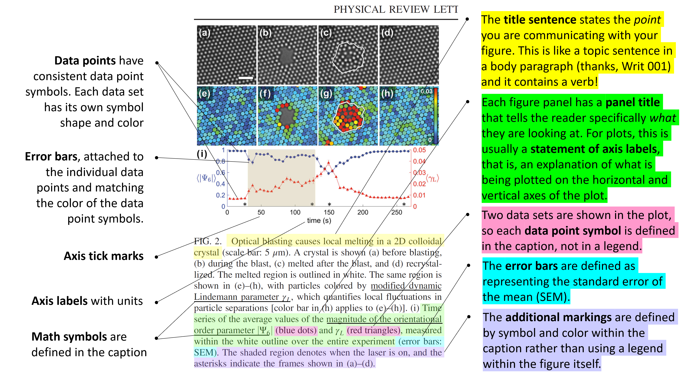
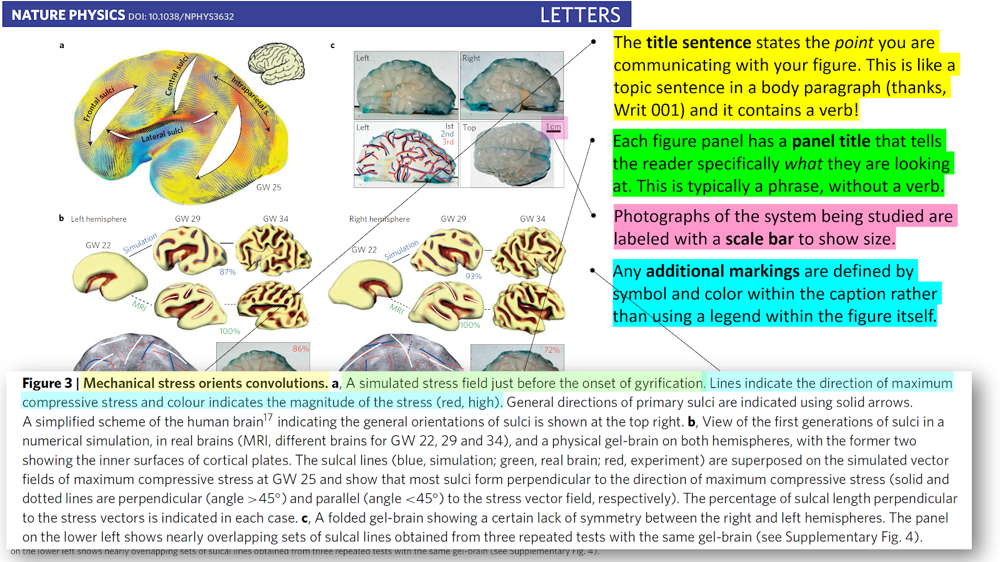
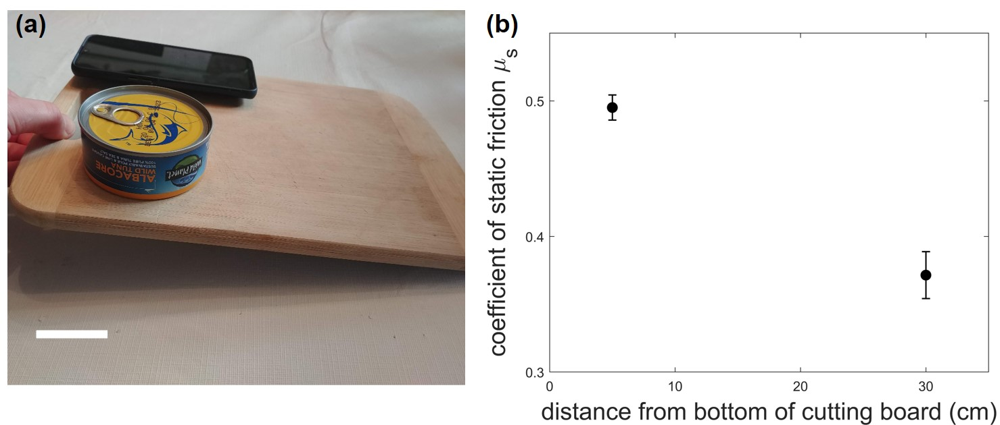

# Week 4: Before you start

Before you start week 4, there are two things we would like to cover with miniquestions:

1. We need your mailing address to send you an experimental kit for Module 3 

2. There was a common point of confusion last week during office hours about how to calculate the uncertainty in $$\mu_s$$. Some were unclear on whether to propagate the resolution uncertainty in $$\theta_c$$ or the random uncertainty (SEM over repeated measurements of $$\theta_c$$).

---------------------------------

#### Miniquestion: Mailing Address
[*Click here to open in a new tab*](https://forms.gle/FtypQB3xq6RFmYio7){:target="_blank"}

<iframe src="https://docs.google.com/forms/d/e/1FAIpQLSdAxAaCYRjN2oxZ6FRN2I6d1CrKKNEmwJqAguXJVfHMwW4S9Q/viewform?embedded=true" width="640" height="300" frameborder="0" marginheight="0" marginwidth="0">Loading…
</iframe>

---------------

#### Miniquestion: Combining Random and Resoultion Uncertainty
[*Click here to open in a new tab*](https://forms.gle/rWo6mJHquyMUXyrX6){:target="_blank"}
<iframe src="https://docs.google.com/forms/d/e/1FAIpQLScy_IJoMPsTvU-vOWYMQs2_s_54tkfSOg01eWkfDsKSJA_YkQ/viewform?embedded=true" width="640" height="600" frameborder="0" marginheight="0" marginwidth="0">Loading…
</iframe>

---------------------------------------------------

# Week 4: Communicating written scientific results, physics-style

While talks, podcasts and videos are all wonderfully rich formats for sharing scientific results, in physics and many other scientific disciplines, the golden standard for communication is a published journal article, or “paper” for short. The physics article is typically composed of (1) a short abstract summarizing the main findings, (2) the main body of the paper, including figures, and (3) a bibliography to help contextualize the results within the broader field of research.

But what if you just don’t have the time to read all those parts of each article you need to check out? The neat trick for quickly scanning physics papers also works as a fantastic method for writing your own paper: focus on the figures. A good rule of thumb is that if you “read” every figure+caption, you should get the gist of the main conclusions of the paper, as well as a sense of how those results were determined. In fact, the sequence of figures+captions acts a lot like an outline you may have produced in Writ 001, in that it conveys the main result (thesis) by showing evidence in support of a sequence of subclaims. The evidence is usually shown directly in the figure, using either a plot with data points or an image of the system studied. The analysis of that evidence is ideally concisely summarized in the figure captions. 

In physics 50, you will ultimately get to experience what it’s like to create a physics poster, which is like a mini version of a physics paper. The first step in that process is to learn how to create a single figure with a caption. For the Module 1 deliverable, you will produce a figure containing a plot, and later in this course you will also create figures that don’t contain a plot. Both types of figures are essential for communicating your scientific results.

## A figure showing a plot 

The most common way to present experimental data is to show a plot, usually with two axes and clearly marked data points with error bars. Most readers will expect to see the main experimental result expressed using a plot -- in fact this is so universal that physicists often refer to the central figure of their publication as “the money plot”!

The fundamental elements that a figure with a plot needs to be effective are:

*In the figure itself*

+ **Axes**, with axis labels, units, and tick marks in a font that is as big as the text in the caption and surrounding paragraphs. It is okay to label an axis using a mathematical symbol for a variable, as long as the symbol is defined with words in the caption.

+ **Data points**, with consistent data point symbols. If there is more than one data set in the plot, each data set should have its own symbol shape and color. These are typically described in the caption, not using a legend.

+ **Error bars**, attached to the individual data points and should match the color of the data point symbols.

+ **(optional) Additional markings:** If there are any additional symbols or marks in the figure that are not data points, they must be clearly separated from and visually distinct (in eg. shape, color) from the data point symbols.

*In the figure caption*

+ **Title sentence:** This short sentence (with a verb!) explains the point of what is shown in the figure. It tells the reader what your data mean and ideally this clearly connects to the main result (thesis) of the paper.

+ **(optional) Panel title:** If the figure has multiple panels (or an inset plot within the main plot), each panel or plot gets its own brief title. This is almost always a phrase, without a verb. For a panel with a plot, it is usually a statement of axis labels (see next bullet point).

+ **Statement of axis labels:** If any axes are labeled using mathematical symbols, those symbols must be defined using words in the caption.

+ **(optional) Definition of data point symbols:** If there is more than one data set shown in the plot, each data point symbol must be defined. Typically this is done in the caption, not in a legend.

+ **Definition of error bars:** The caption must define what the error bars represent (for example, they might represent [the standard error of the mean](uncertainty-introduction#random-uncertainty), or SEM).

+ **(optional) Definition of additional markings:** If there are any additional symbols or marks in the figure that are not data points, those symbols must be defined in the caption, not in a legend.

Here is an annotated example of a figure with a plot, taken from [this article](https://journals.aps.org/prl/abstract/10.1103/PhysRevLett.120.018002){:target="_blank"} in the journal Physical Review Letters. Note that the figure also contains some experimental images that help to convey the main point of the figure, but for the purposes of this lesson, we will just focus on the last panel of the figure, which contains a plot.

[*Click on the image to enlarge in a new tab:*
](images/annotated-figure-plot.png){:target="_blank"}

## A figure without a plot

Even figures that don’t have an explicit plot with data points still can present essential experimental data. Often data takes the form of photographs, microscope images, or other specialized images like those obtained from X-ray diffraction or magnetic resonance imaging. This kind of data can play a critical role in showing your experimental results, even without a traditional plot with labeled axes and clearly defined data points. 

You will recognize many of the same elements as for a figure with a plot, and some new ones:

In the figure itself

+ **Scale bar:** Any experimental images (eg. from a microscope) should be accompanied by a scale bar, which provides a sense of the size of the system studied. Usually a scale bar is a plain, thick horizontal line segment in black or white. The length of the scale bar is either written directly above or below the bar, or it is provided in the caption.

+ **(optional) Additional markings:** If there are any additional symbols or marks in the figure that are not data points, they must be visually distinct (in eg. shape, color) from the images shown in the figure.

*In the figure caption*

+ **Title sentence:** This short sentence (with a verb!) explains the point of what is shown in the figure. It tells the reader what your data mean and ideally this clearly connects to the main result (thesis) of the paper.

+ **(optional) Panel title:** If the figure has multiple panels, each panel gets its own brief title. This is almost always a phrase, without a verb. 

+ **(optional) Definition of scale bar:** If the scale bar length is not shown in the figure, it must be clearly defined in the caption.

+ **(optional) Definition of additional markings:** If there are any additional symbols or marks in the figure that are not data points, those symbols must be defined in the caption, not in a legend.

Here is an annotated example of a figure without a plot, taken from [this article](https://www.nature.com/articles/nphys3632) in the journal *Nature Physics*. Again, this figure consists of many individual panels, some of which are obscured below to allow room for the annotations. To see the full figure in proper context, we encourage you to follow the link above to take a look at the original article.

[*Click on the image to enlarge in a new tab:*
](images/annotated-figure-no-plot.png){:target="_blank"}

--------------
#### Miniquestion: What's wrong with this figure?
[*Click here to open in a new tab*](https://forms.gle/ffTusS9iJrceYnso9){:target="_blank"}
<iframe src="https://docs.google.com/forms/d/e/1FAIpQLSf8_p6Lsi88Q6wHKpcgfzDTnEXGxgBQsXeijAAHam57e0Lj7w/viewform?embedded=true" width="640" height="600" frameborder="0" marginheight="0" marginwidth="0">Loading…
</iframe>

---------------

## Reporting Data with Significant Figures

Another thing to consider when communicating your results is the number of significant figures (decimal places) you report. Imagine you calculated the coefficient of static friction and its uncertainty. The value you obtain from Google Sheets is 0.44030407 ± 0.00403726. So you should communicate this value when you write up your experimental results, right? Hold on:  do you really know the value of $$\mu$$ to the 8th decimal place? Our uncertainty of $$\delta \mu_s = $$0.00403726 tells us that we are unsure of the 3rd decimal place, so we are definitely not sure about the value in the 8th decimal place of $$\mu_s = $$0.44030407! This digit is insignificant;you don’t truly have that kind of precision in this experiment and cannot quote results that would imply otherwise.

This is where the term significant digits, or “sig figs” for short, comes into play. We only want to report digits that are significant — accurately reflect the precision of our experiment — in our results. We will now present the rule of thumb for determining significant digits:

1. Round and keep only one digit in your uncertainty

    + in our example this would mean we report our uncertainty as $$\delta \mu_s = 0.004$$

    **Exception**: if the most significant digit — in our example above, the digit in red 0.00403726 — is a 1 or 2, then report two digits in the uncertainty. For example: if your uncertainty is 0.0237304 then its most significant digit is a 2 so we will keep two digits, resulting in an uncertainty of 0.024 after rounding.

2. Round your measured value so the placement of the least significant digit matches that of the rounded uncertainty. Wow, that sounds confusing so let’s see how this applies to our example above:

    + in our example we began with 0.44030407 ± 0.00403726. We determined that the uncertainty should be 0.004, meaning the least significant digit of the uncertainty is in the 3rd decimal place. We need to round our measurement value to the same digit so the value we will report for our measurement is **0.440 ± 0.004**.

#### Miniquestion: Reporting Significant Figures
*[Click here to open in a new tab](https://docs.google.com/forms/d/e/1FAIpQLSf1OFObboakQdFkymAOxaCNowGB7LPWrEzHXvSNMqERC2eYFQ/viewform){:target="_blank"}*

<iframe src="https://docs.google.com/forms/d/e/1FAIpQLSf1OFObboakQdFkymAOxaCNowGB7LPWrEzHXvSNMqERC2eYFQ/viewform?embedded=true" width="640" height="300" frameborder="0" marginheight="0" marginwidth="0"> Loading…
</iframe>

---------------------------

## Guide to MATLAB plotting and figure assembly in Powerpoint

**We strongly recommend** that you learn how to plot your data using MATLAB by following the steps we've outlined in the [MATLAB Plotting + Powerpoint Figure Assembly Guide](plotting-guide){:target="_blank"}. There's also some important information there about how to make your plots and figures easier to read.   

 
 

[Click here to open the MATLAB Plotting + Powerpoint Figure Assembly Guide in a new tab](plotting-guide){:target="_blank"}.

 
 
## Module 1 Deliverable

What do I need to make for Module 1?

For Module 1, your deliverable is a single figure, with a caption, that conveys what you learned from your experimentation. Remember: **Experimental science is not about getting the "right" or expected answer.** You are trying to make a careful conclusion that is supported by the data you collected. If your data doesn't support the hypothesis, you should draw a cautious and properly qualified conclusion based on your data.

In your experiment, you explored the effect of mass on the coefficient of static friction, but to give you a sense of what we hope your figure will be like, let’s imagine for a moment that you were studying the effect of location on the inclined plane (eg. cutting board) on the coefficient of static friction. Here’s what a figure about that might look like:

Figure 1. Coefficient of static friction depends on the location of the tuna can on the cutting board. (a) Experimental setup. The coefficient of static friction was determined by measuring the critical angle for two different starting locations of a tuna can on a cutting board. Scale bar: 5 cm. (b) The two values do not agree within the error bars, which indicate the standard error of the mean.

#### Your figure should include:
+ a visual representation of your experimental setup (a photo or clearly drawn schematic drawing) 
+ a plot with the data that supports the conclusion you've drawn
+ a caption

#### Your figure will be evaluated on (in order of decreasing weight):
1. accuracy: does the figure accurately characterize your experiment? Are the data, uncertainties, scale bars, conclusion etc. correctly determined from what you measured? Are the units of any values correct?

2. experimental procedure: Do the results show evidence of careful and thoughtful experimentation? 

3. plot of the data: Is the plot clearly laid out and properly labeled? Does it contain all of the required items from the guidelines above?

4. caption: Does the caption summarize the results of your experiment? Does it contain all of the required items from the guidelines above?

5. visual representation of your experimental setup: Is your photo or schematic clear and free of visual distractions? Is there a scale bar included? 

6. aesthetic clarity: Are all displayed objects (e.g. text, images, data points, lines) large enough to be visible and not pixelated? Was some consideration given to "salience" and "simplicity"? ([described here](plotting-guide#plotting-the-example-data){:target="_blank"}) Is the figure laid out in a way that flows well and is easy to follow?

Don't forget to double-check that you've completed all of the miniquestions for this week. You should also make sure that you've completed the miniquestions for all the weeks of Module 1 for at least partial credit. You can find them all [gathered here](mini-questions).
